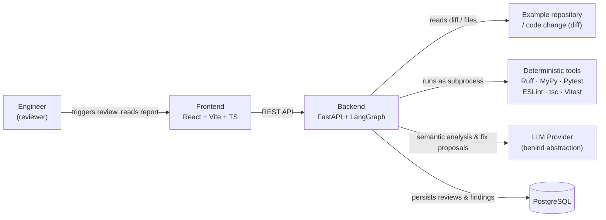
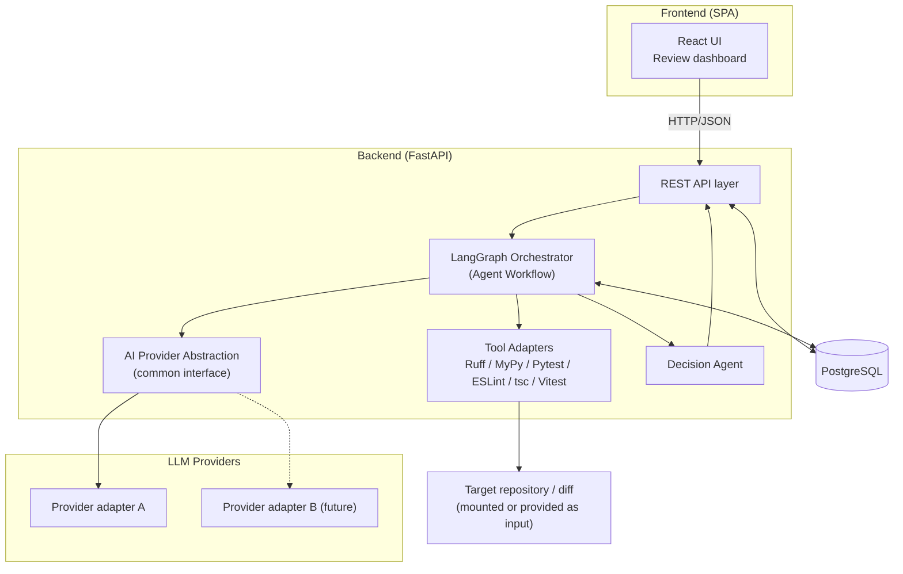
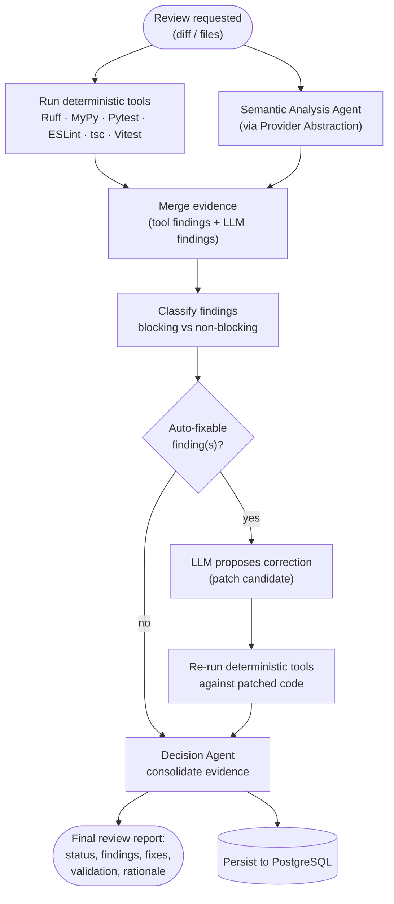
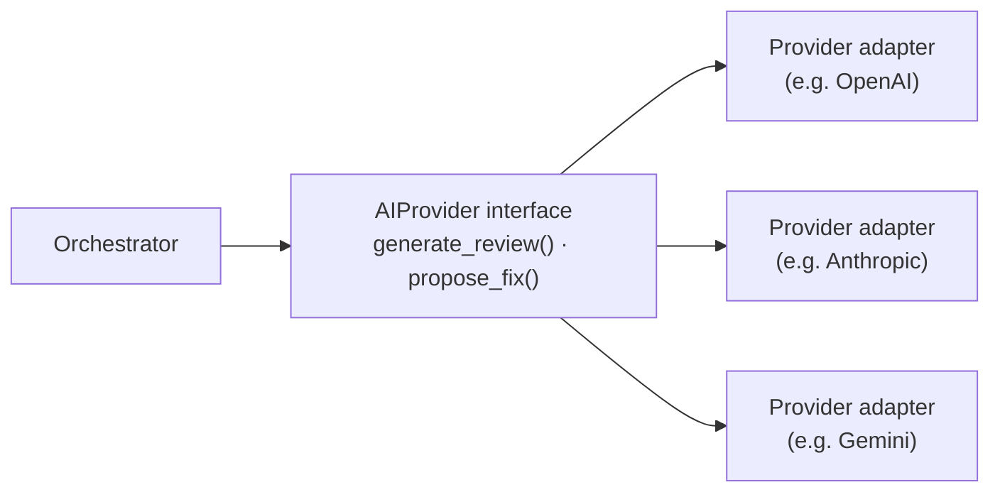

# Guardian AI — Architecture

## 1. Purpose

Guardian AI is a functional prototype of an agentic AI system that supports the software
development lifecycle (SDLC) of an e-commerce engineering team. It automates part of the
code review process by combining **LLM-based semantic reasoning** with **deterministic
evidence from standard development tools** (linters, type checkers, test runners), and
consolidates all findings into a single, transparent, explainable decision.

The goal of this document is to describe the architecture of the system before
implementation, so that every component has one clear responsibility and every
significant technical decision can be justified during the challenge presentation.

## 2. Scope

This is a technical challenge prototype, not a production system. The scope is
intentionally small and demonstrable:

- One example e-commerce repository (or a fixed set of example diffs) used as the subject
  of analysis.
- A backend service that orchestrates an agentic workflow using LangGraph.
- A frontend that lets a user trigger a review and inspect the resulting report.
- A PostgreSQL database that persists reviews and their results for later inspection.
- A Docker Compose setup that runs the whole system locally with one command.

Out of scope: multi-repository support, CI/CD integration, user authentication, real-time
collaboration, and anything listed in [Section 19 — Explicit non-goals](#19-explicit-non-goals).

## 3. Capabilities implemented

The challenge requires at least two agentic capabilities. Guardian AI implements:

1. **Review code changes and provide useful, actionable feedback.**
   Given a code change (diff), the system produces a structured review: a summary,
   a list of blocking and non-blocking findings, and suggested fixes, backed by both
   deterministic tool output and LLM reasoning.

2. **Detect problems in code, propose a correction, and validate the proposed correction.**
   For findings that are auto-fixable, the system asks the LLM to propose a concrete
   patch, applies it in an isolated context, and re-runs the relevant deterministic
   tools against the patched code to validate that the fix resolves the issue without
   introducing new ones. The validation result (pass/fail) is part of the final report.

Both capabilities share the same evidence model and the same Decision Agent, which keeps
the system small and avoids duplicated logic.

## 4. System context

Guardian AI sits between the engineer and the codebase: it never replaces the engineer's
judgment, it produces evidence-backed input for a decision the team ultimately owns.

## 5. High-level architecture

Key idea: the **Orchestrator** never talks to a specific LLM vendor or a specific tool
binary directly — it talks to an **AI Provider Abstraction** and to **Tool Adapters**,
both of which hide vendor/tool-specific details behind a stable interface.

## 6. Main components

| Component | Responsibility |
|---|---|
| **Frontend (React SPA)** | Trigger reviews, display evidence and the final decision. No business logic. |
| **API layer (FastAPI)** | Expose REST endpoints, validate input, translate HTTP ↔ domain models. |
| **Orchestrator (LangGraph)** | Coordinate the agent workflow: run tools, call the LLM, aggregate evidence, invoke the Decision Agent. |
| **Tool Adapters** | Run Ruff, MyPy, Pytest, ESLint, tsc, Vitest as subprocesses; normalize their output into a common `Evidence` shape. |
| **AI Provider Abstraction** | Common interface (`generate_review`, `propose_fix`, etc.) implemented by one or more provider-specific adapters. |
| **Decision Agent** | Consolidates all evidence into one review status, blocking/non-blocking findings, suggested fixes, and validation results. |
| **Persistence layer** | Store review requests, evidence, findings, and decisions in PostgreSQL. |
| **Docker Compose stack** | Reproducible local execution of frontend, backend, and database. |

## 7. Agent workflow

The orchestration is modeled as a LangGraph graph. Each node has one responsibility, and
edges represent the flow of evidence, not free-form chat.

Notes on the workflow:

- Deterministic tools and the Semantic Analysis Agent run against the **same** input and
  produce evidence independently; the LLM is never the sole source of truth.
- The **fix / validate** loop is bounded (a fixed number of attempts, e.g. one retry) to
  keep runtime and cost predictable — this is a prototype, not an autonomous fixing agent.
- The **Decision Agent** is the only node allowed to produce the final status; every
  other node only contributes evidence.

## 8. Evidence model

All evidence — regardless of source — is normalized into a single shape before reaching
the Decision Agent. This is what allows the system to remain tool-agnostic and to add or
remove tools without changing the decision logic.

Conceptual `Evidence` item:

- `source`: `"llm"` | `"ruff"` | `"mypy"` | `"pytest"` | `"eslint"` | `"tsc"` | `"vitest"`
- `severity`: `"blocking"` | `"non_blocking"` | `"info"`
- `category`: e.g. `"style"`, `"type_error"`, `"test_failure"`, `"security"`, `"design"`
- `location`: file path + line range (when applicable)
- `message`: human-readable description
- `suggested_fix` (optional): proposed patch or textual suggestion
- `confidence` (optional, LLM-only): qualitative confidence of the finding

Deterministic tools produce evidence directly from their native output (exit codes,
JSON/text reports). The LLM is prompted to return evidence in this same shape, so the
Decision Agent treats every source uniformly. Severity mapping (e.g. "a Pytest failure is
always blocking", "an ESLint warning is non-blocking unless it's a `no-*-vulnerabilities`
rule") is an explicit, reviewable rule set — not an LLM decision.

## 9. AI provider abstraction

The application must not depend directly on any specific LLM vendor. A common interface
is defined at the boundary between the Orchestrator and the outside world, e.g.
(conceptually):

- The Orchestrator and Decision Agent depend only on the interface, never on a concrete
  vendor SDK.
- Provider-specific logic (auth, request/response shape, prompt formatting quirks) is
  fully contained inside its adapter.
- The concrete provider used at runtime is selected via configuration/environment
  variables (`.env`), not hardcoded.
- The initial concrete provider is intentionally still pending; the abstraction is
  designed so selecting or swapping a provider is a configuration change, not a code
  change to the Orchestrator.

## 10. Backend architecture

- **Framework**: FastAPI, exposing a small REST API (e.g. `POST /reviews`,
  `GET /reviews/{id}`).
- **Orchestration**: LangGraph defines the agent graph described in
  [Section 7](#7-agent-workflow); nodes are plain Python functions/classes with single
  responsibilities.
- **Layering**:
  - `api/` — HTTP concerns only (routing, request/response schemas).
  - `orchestrator/` — LangGraph graph definition and node implementations.
  - `tools/` — Tool Adapters (Ruff, MyPy, Pytest, ESLint, tsc, Vitest) run as subprocesses
    with parsed, normalized output.
  - `providers/` — AI Provider Abstraction and concrete adapters.
  - `domain/` — Evidence, Finding, Review, Decision models, independent of frameworks.
  - `persistence/` — repositories/ORM mapping domain models to PostgreSQL.
- Tool execution runs against a local checkout/copy of the target example repository
  (or against a diff applied to it), isolated per review request to avoid cross-request
  interference.
- All external calls (LLM, subprocess tools) have explicit timeouts; failures degrade the
  affected evidence to "unavailable" rather than crashing the whole review.

## 11. Frontend architecture

- **Stack**: React + Vite + TypeScript + Tailwind CSS, single-page application.
- **Responsibility**: trigger a review, poll/show its status, render the final report
  (summary, blocking/non-blocking findings, suggested fixes, validation results).
- **No business logic in the frontend**: severity, classification, and the final decision
  are always computed by the backend; the frontend only renders what the API returns.
- **Data flow**: a thin API client layer calls the backend REST API; UI components are
  presentational and consume typed responses (shared types generated or mirrored from the
  backend's response schema).

## 12. Persistence

PostgreSQL stores the durable record of what Guardian AI evaluated and decided:

- `reviews` — one row per review request (target, diff reference, timestamps, overall
  status).
- `evidence` — normalized evidence items collected from tools and the LLM, linked to a
  review.
- `findings` — classified findings (blocking/non-blocking), linked to evidence.
- `fix_attempts` — proposed corrections and their validation outcome, linked to a finding.

This gives the system an audit trail: every decision can be traced back to the concrete
evidence that produced it, which is essential for explainability.

## 13. Infrastructure and local execution

- **Docker Compose** defines three services: `frontend`, `backend`, `db` (PostgreSQL),
  plus the deterministic tools installed inside the backend image (Ruff, MyPy, Pytest,
  ESLint, tsc, Vitest via Node.js).
- **Environment variables** (`.env`, documented in `.env.example`) configure: database
  connection, selected AI provider, provider API key, and any tool-specific settings.
  No secrets are committed to the repository.
- The entire system is reproducible with a single `docker compose up`, which is a hard
  requirement for evaluating the challenge.
- No Kubernetes, no Redis, no additional infrastructure services — the scope does not
  justify them.

## 14. Security and privacy considerations

- **Secrets**: API keys are supplied only via environment variables, never hardcoded or
  logged.
- **Code exposure to the LLM**: only the code under review (diff and, when needed, small
  surrounding context) is sent to the provider — not the full repository history.
- **Sandboxing of tool execution**: deterministic tools run as subprocesses against a
  copy/checkout of the example repository, not against arbitrary user-supplied paths, to
  reduce the risk of path traversal or unintended file access.
- **No arbitrary code execution beyond configured tools**: the system runs a fixed,
  known set of tools/commands; it does not execute LLM-generated code directly — proposed
  fixes are validated by re-running the same deterministic tools, not by executing
  arbitrary generated scripts.
- **Data at rest**: review data stored in PostgreSQL is limited to code snippets and
  findings relevant to the demo; no user PII is collected.

## 15. Cost considerations

- LLM usage is the main variable cost driver. The workflow bounds cost by:
  - Sending only the diff/changed files (not the whole repository) to the LLM.
  - Limiting the fix/validate loop to a small, fixed number of attempts.
  - Using deterministic tools first, so the LLM is not asked to re-derive facts a linter
    or type checker already provides.
- Provider abstraction allows swapping to a cheaper/faster model for a given environment
  (e.g. demo vs. development) purely through configuration.
- No vector database, no embeddings pipeline, no background re-indexing — all of which
  would add cost without being required by the two target capabilities.

## 16. Performance considerations

- Deterministic tool checks (Ruff, MyPy, ESLint, tsc) are fast and run in parallel with
  the Semantic Analysis Agent to reduce end-to-end latency.
- Test execution (Pytest, Vitest) is scoped to the example repository, which is
  intentionally small, keeping run time short and predictable.
- The fix/validate loop is bounded (see [Section 7](#7-agent-workflow)) to avoid unbounded
  latency or cost from repeated LLM calls.
- For the scope of this prototype, a single review request is processed synchronously
  end-to-end; the architecture does not preclude adding an async job queue later
  (see [Section 20](#20-future-extensions)), but it is not needed at this scale.

## 17. Observability

- **Structured logging** in the backend for each workflow node (tool invoked, exit code,
  duration; LLM call made, provider, duration) to make the agent's behavior traceable
  during the presentation.
- **Persisted evidence trail** (Section 12) itself acts as an audit log: every finding and
  decision can be inspected after the fact via the database, not just in transient logs.
- **Correlation id** per review request, propagated through all tool invocations and LLM
  calls, so a single review's full trace can be reconstructed from logs.
- Metrics/tracing dashboards (e.g. OpenTelemetry, Prometheus) are explicitly out of scope
  for the MVP — logging and the persisted trail are sufficient to explain the system's
  behavior in a short technical challenge.

## 18. Testing strategy

- **Backend unit tests (Pytest)**: domain logic (evidence normalization, severity
  classification, Decision Agent rules) tested in isolation from tools and LLM calls
  (provider and tool adapters mocked).
- **Tool adapter tests**: verify that raw output from Ruff/MyPy/Pytest is correctly parsed
  into the common `Evidence` shape, using fixed sample outputs.
- **Frontend unit/component tests (Vitest)**: rendering of the review report given a fixed
  API response fixture.
- **End-to-end smoke test**: running a full review against one fixed example diff in the
  sample e-commerce repository, asserting that a final decision is produced with the
  expected structure — this doubles as the main demo scenario.
- The LLM itself is not unit-tested (non-deterministic); the system is designed so that
  its correctness does not depend solely on LLM output — deterministic tool evidence and
  classification rules are covered by tests, and the LLM is exercised through the
  end-to-end smoke test with tolerance for wording variance.

## 19. Explicit non-goals

To keep the scope realistic for a short technical challenge, Guardian AI explicitly does
**not** include:

- Multi-repository or multi-project support.
- CI/CD pipeline integration (e.g. GitHub Actions, webhook-triggered reviews).
- User authentication, authorization, or multi-tenant access control.
- Real-time collaboration or live-updating UI beyond simple polling.
- SonarQube integration (optional future enhancement only, not part of the MVP).
- Kubernetes, Redis, RAG/vector search, or model fine-tuning/training.
- Autonomous, unbounded self-fixing agents (fix attempts are bounded and always validated
  by deterministic tools, never auto-merged).
- Support for arbitrary/unknown programming languages beyond the stack used by the
  example repository (Python/TypeScript).

## 20. Future extensions

These are acknowledged as reasonable next steps, but intentionally deferred:

- **SonarQube integration** as an additional deterministic evidence source (static
  analysis, code smells, security hotspots).
- **Asynchronous processing** (job queue) for larger repositories or slower tool runs,
  decoupling review submission from execution.
- **CI/CD hook** to trigger Guardian AI automatically on pull requests.
- **Multiple simultaneous LLM providers** used for cross-validation of semantic findings.
- **Richer diffing** (whole-PR context, historical review trends) instead of single-diff
  analysis.
- **Metrics/tracing stack** (OpenTelemetry) if the system needs to scale beyond a
  single-demo usage pattern.

## 21. Main architectural trade-offs

| Decision | Trade-off accepted |
|---|---|
| Deterministic tools + LLM, not LLM-only | More moving parts (subprocess orchestration) in exchange for objective, reproducible evidence and reduced hallucination risk. |
| Synchronous, single-request processing | Simpler implementation and easier to demo, at the cost of not scaling to concurrent heavy workloads. |
| Bounded fix/validate loop (fixed retries) | Slightly less "autonomous" than an unbounded agent, in exchange for predictable cost/latency and safer behavior. |
| Provider-agnostic abstraction from day one | Extra indirection layer now, in exchange for zero vendor lock-in and easy provider swaps later. |
| PostgreSQL for persistence (no cache layer) | Slightly higher read latency than a cached setup, avoided for the sake of not introducing Redis without a proven need. |
| No async job queue in the MVP | Cannot process long-running reviews in the background yet, acceptable given the small size of the example repository. |
| Logging + persisted trail instead of a full observability stack | Less powerful introspection than OpenTelemetry/Prometheus, but sufficient and much simpler for a short technical challenge. |
